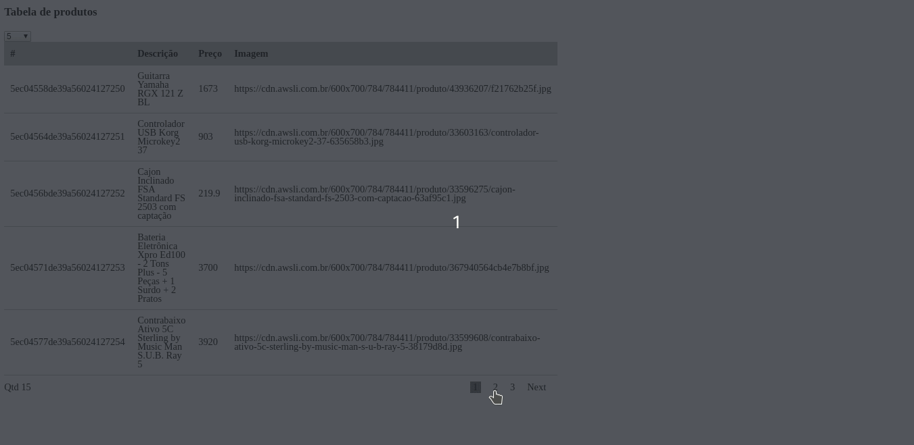

<div align="center">
 
</div>

<p align="center">🎉
  <a href="#-sobre"> Sobre </a>&nbsp;&nbsp;&nbsp;|&nbsp;&nbsp;&nbsp;
  <a href="#-conceitos-ensinados">Conceitos ensinados</a>&nbsp;&nbsp;&nbsp;|&nbsp;&nbsp;&nbsp;
  <a href="#-material-de-apoio">Material de apoio</a>&nbsp;&nbsp;&nbsp;|&nbsp;&nbsp;&nbsp;
    <a href="#-como-baixar">Como baixar</a>
</p>

## ✍🏻 Conceitos

Durante o desenvolvimento, foi aprendido sobre `styled components` para estilização de componentes, como realizar paginação no `frontend` e `axios` para acesso a API.

## 🗂 Material de apoio

- [Create React App](https://github.com/facebook/create-react-app)
- [ReactJS](https://pt-br.reactjs.org/)
- [Axios](https://github.com/axios/axios)
- [Styled Components](https://styled-components.com/)

## 👍🏻 Como baixar

```bash

    // Clonar repositório
    $ git clone https://github.com/Wesleygmssa/pagination-table

    // Acessar diretório
    $ cd pagination

    // Instalar dependências
    $ yarn

    // Iniciar projeto
    $ yarn start
```

---

<h3 align="center">Desenvolvido por  💜 Wesley Guerra </h3>
